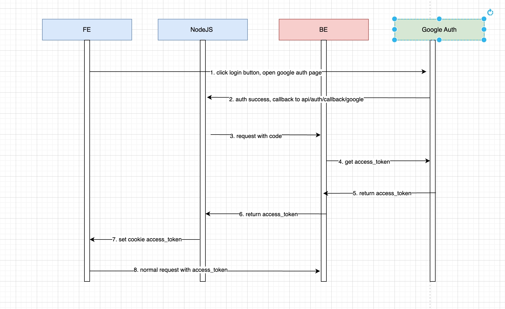

# 前端 nextJS + react 学习

## next 项目知识

官网：[https://nextjs.org/docs](https://nextjs.org/docs)

### 项目结构

与 nuxt 类似，默认入口为 `/app/page.tsx`，然后会按文件结构自动转为路由层级。

### 路由

- 文件形式

  | [folder] |     动态路由     |
  | :------: | :--------------: |
  | (folder) | 不影响路由的分组 |

- 路由链接跳转

  对应 nuxt 里的 `<NuxtLink />` 

  ```tsx
  import Link from 'next/link'
  
  export default function Link() {
   return (
      <>
        <Link href={"/about-us"}>普通跳转</Link>
        <Link href={{ path: "/about-us", query: { tab: 12345 } }}>
          带参数跳转
        </Link>
      </>
    )
  }
  ```

- 进阶 hooks

  ```tsx
  "use client"
  import { useRouter, usePathname, useSearchParams, useParams } from "next/navigation"
  
  export default function RouterTest() {
    const router = useRouter()
    router.push('/about-us')					// 路由跳转 - 可以点击回退按钮回退
    router.replace('/about-us')       // 路由跳转 - 不可以点击回退按钮回退
    router.refresh()  								// 刷新路由
    router.back()											// 返回上一级
    router.forward()									// 前进下一级
    
    const pathName = usePathname()
    console.log(`当前路由为: ${pathName}`)
    
    // 假设现在的 url 上有 ?tab=12345
    const query = useSearchParams()
    console.log(query.get("tab"))
    
    // 假设现在路由是动态的，/new/[id]/page.tsx内
    const param = useParams()
    console.log(`当前的动态路由值为${param.id}`)
    return (
      <div></div>
    )
  }
  ```

### 布局

- 默认布局

  放在 app / layout.tsx 就是默认布局，使用的是 reactNode 来作为类似 nuxt 的插槽。

  ```tsx
  export default function RootLayout({
    children,
  }: {
    children: React.ReactNode;
  }) {
    return (
      <html lang="en">
        <body>
          <div className="w-full h-30 bg-sky-500">Header</div>
          {children}
          <div className="w-full h-30 bg-green-500">Footer</div>
        </body>
      </html>
    )
  }
  ```

- 作用范围

  ```
  app/
  ├── layout.tsx        （全局布局）
  ├── page.tsx          （首页）
  ├── some-route/
  │   ├── layout.tsx    （作用于 some-route 及其子路由）
  │   ├── page.tsx      （作用于 some-route）
  │   ├── sub-route/
  │   │   ├── page.tsx  （作用于 some-route/sub-route）
  ```

## react 基础

### 参数传递 - 父传子

- 使用 **传参 + 插值** 的方式传递参数

  这里的 name = ' ' 是默认值

  ```jsx
  export default function User({ name = '' }) {
    return (
      <div className="w-100 h-100 bg-sky-200">{name}</div>
    )
  }
  
  /* 当然也可以这么写，所有传入的参数都在props下，结构的话就是props.children
  export default function User(props) {
    return (
      <div className="w-100 h-100 bg-sky-200">{props.name}</div>
    )
  }
  */
  
  export default function App() {
    return <User name="TieNiu"/>
  }
  ```

---

### 参数传递 - 子传父

- 使用 子组件调用父组件传递的回调函数，从而影响父组件。

  ```jsx
  import { useState } from "react"
  
  export default function Parent() {
    const [count, setCount] = useState(0)
    const handleClick = () => {
      setCount((prev) => prev + 1)
    }
  
    return (
      <div>
        <p>子组件点击了 {count} 次</p>
        <ChildBtn onClick={handleClick} />
      </div>
    )
  }
  
  function ChildBtn({ onClick }) {
    return (
      <button onClick={onClick}>点击增加</button>
    )
  }
  ```

---

### 循环渲染 - map

**对应 vue 的 v-for**，在 react 中，使用 js + map 来循环渲染，记得加 key

- 使用

  ```jsx
  function CeilTab({ propsArr }) {
    return (
      <ul>
        {propsArr.map((item) => (
          <li key={item.title}>
            <p>{item.title}</p>
            <div>{item.des}</div>
          </li>
        ))}
      </ul>
    )
  }
  
  export default function Page() {
    const arr = [
      { title: "one", des: "a description" },
      { title: "two", des: "a test" },
      { title: "three", des: "final description" },
    ]
    return <CeilTab propsArr={arr} />
  }
  ```

---

### 组件复合 - 插槽

类似 vue 插槽


## Hooks

允许函数组件“钩入” React 核心特性（状态、生命周期），和普通函数相比，普通函数是给定的特定输入，返回输出，而 hook 类似闭包，能记住上次的状态还能操作组件的内部。

### useState - 状态hook

最常用的 hook，用来引入状态，使用数组，数组里分别为 get 与 set。

- 使用

  ```jsx
  import { useState } from 'react'
  
  function Counter() {
    const [count, setCount] = useState(0)
  
    const increment = () => {
      setCount(count + 1)
    }
  
    return (
      <div>
        <p>Count: {count}</p>
        <button onClick={increment}>Increment</button>
      </div>
    )
  }
  ```

- 使用 - 处理对象

  ```jsx
  import { useState } from 'react'
  
  function UserProfile() {
    const [profile, setProfile] = useState({ name: 'tie-niu', age: 28 })
  
    const updateName = () => {
      setProfile({ ...profile, name: 'zhao-tie-niu' }) // 使用展开运算符更新对象
    }
  
    return (
      <div>
        <p>Name: {profile.name}</p>
        <p>Age: {profile.age}</p>
        <button onClick={updateName}>Change Name</button>
      </div>
    );
  }
  ```

---

### useEffect - 副作用hook

跟 vue 的 onMounted 和 watch 非常像，用来 **“观察状态”**，

- 使用

  ```jsx
  const [name, setName] = useState('tie-niu')
  useEffect(() => {
    console.log(name)
  }, [name])
  ```

  这就类似于 watch，当状态值变化时执行回调。

- 参数

  对于第二参数，分几种情况：

  |  第二参数内容  |                           执行方式                           |
  | :------------: | :----------------------------------------------------------: |
  |       []       |      只在该组件挂载时执行回调，卸载时执行返回的清理函数      |
  | [状态1, 状态2] |                   只要状态值改变就执行一次                   |
  |       空       | 组件每次渲染都会执行回调，如果返回了清理函数，就每次渲染的时候都会清理下上一轮的清理函数再执行回调 |

- 返回值

  返回一个清理函数，会根据第二传参对应的时机来调用这个函数，通常用来清除定时器、取消网络请求等。

  ```react
  useEffect(() => {
    const timer = setTimeout(() => {
      console.log('Timer triggered')
    }, 1000)
  
    return () => {
      clearTimeout(timer)
    }
  }, [])
  ```

---

### useMemo - 记忆hook

用来缓存计算结果，做性能优化，避免每次渲染时重复计算，**类似于 vue 的 computed**

- 使用

  ```jsx
  import { useMemo } from 'react'
  
  // 只有当 a 或 b 发生变化才会重新执行函数
  const memoizedValue = useMemo(() => computeExpensiveValue(a, b), [a, b])
  ```

- 参数

  接受无传参的回调函数，首次渲染时会调用此函数，只要依赖的值没发生变化，就一直用缓存的结果。

  第二参数为依赖数组。
  
- 与 `memo()` 的区别

  memo( ) 是高阶组件(**HOC - 即参数为组件，返回值也为组件的函数**)

1. memo( ) 的作用

   memo 可以让一个组件在参数变化时才会被重新渲染，即便父组件重新渲染了，只要组件的参数没有变化就不会重新渲染。

2. memo( ) 的使用方法

   ```jsx
   import { memo, useState } from 'react'
   
   // 未优化的组件 - 每次父组件渲染时都会重新渲染
   function Message({ text }) {
     console.log('Message 渲染了')
     return <div>{text}</div>
   }
   
   // 使用 memo 优化后的组件 - 只有 text 变化时才会重新渲染
   const MemoizedMessage = React.memo(function Message({ text }) {
     console.log('MemoizedMessage 渲染了')
     return <div>{text}</div>
   })
   
   // 父组件
   function ChatApp() {
     const [count, setCount] = useState(0)
     
     return (
       <div>
         <button onClick={() => setCount(c => c + 1)}>点击计数: {count}</button>
         
         {/* 未优化的组件 - 每次点击按钮都会重新渲染 */}
         <Message text="Hello" />
         
         {/* 优化后的组件 - 点击按钮不会重新渲染，因为 text 没变 */}
         <MemoizedMessage text="Hello" />
       </div>
     )
   }
   ```

---

### useRef - 引用hook

- 使用

  与 useState 类似，区别在于 useRef 的值**不用来渲染**，通常用来获取 dom 元素的引用，与 vue 中用 ref 初始化 DOM 类似。使用 `.current` 获取最新的值

  ```react
  import { useRef } from 'react'
  
  function MyComponent() {
    const inputRef = useRef(null)
  
    const focusInput = () => {
      inputRef.current.focus() // 访问并聚焦 input 元素
    }
  
    return (
      <div>
        <input ref={inputRef} type="text" />
        <button onClick={focusInput}>Focus the input</button>
      </div>
    )
  }
  ```

---

### useCallback - 函数hook

**将一个函数与一组依赖相绑定**，当依赖发生变化则返回新的函数地址，**函数本身不会自动执行**。

- 使用方法

  第一参数为要缓存的函数，第二参数为依赖数组。

  ```jsx
  const memoCallback = useCallback(() => {
    console.log('这个函数会被缓存')
  }, [])
  ```

- 进阶

  ```jsx
  "use client"
  import { useCallBack, memo, useState } from "react"
  
  export default function Parent() {
    const [parentState, setParentState] = useState(0) //父组件的state
  
    //需要传入子组件的函数
    const toChildFun = () => {
      console.log("需要传入子组件的函数")
    }
  
    return (
      <div>
        <button onClick={() => setParentState((val) => val + 1)}>
          点击我改变父组件中与Child组件无关的state
        </button>
        <Child fun={toChildFun}></Child>
      </div>
    );
  }
  
  const Child = memo((props) => {
    props.fun()
    console.log("重新构建")
    return <div></div>
  })
  ```

  传给子组件一个函数在子组件调用，并且只要子组件渲染就会打印“重新构建”。

  **发现：**点击父组件的按钮，改变父组件的状态，而父组件里有要传给子组件的函数，虽然用memo() 包裹了子组件，但是函数重新初始化了，导致了子组件的重新渲染。

  这个时候就要使用 `useCallback` 将函数的地址缓存起来作为依赖：

  ```jsx
  const toChildFun = useCallback(() => {
    console.log("需要传入子组件的函数")
  }, [])
  ```

  这样就算父组件重新渲染了，但是函数地址没发生变化，会用缓存好的函数，让子组件不会重新渲染。

---

## 常用第三方 hook

### useTranslation

useTranslation 是 I18n 多语言的常用方法。来自于 `'react-i18next'` 库

- 使用

  ```jsx
  export function MyComponent() {
    const { t } = useTranslation('common')
    return <div>{t('title')}</div>
  }
  ```

  也可以插值，此文件位于 locales / zh-CN / chat.json

  ```json
  {
    "history": {
      "title": "助手将只记住最后{{count}}条消息"
    },
  }
  ```

  这是 `i18n` 的翻译配置，里面有插值

  ```jsx
  export function MyComponent() {
    const { t } = useTranslation('chat')
    return <div>{t('history.title', { count: historyCount })}</div>
  }
  ```


---

## 数据库SQL 相关

### 执行顺序

SELECT 选取 FROM 来源 WHERE 条件 GROUP BY 分组 HAVING 条件 ORDER BY 顺序 LIMIT 限制

### 基础语法

- 导入全部数据

  ```sql
  SELECT * FROM students;
  ```

- 导出数据中的 姓名, 班级, 成绩

  ```sql
  SELECT 姓名, 班级, 成绩 FROM students;
  ```

- 导出数据中的 姓名, 班级, 成绩，限制项数 5

  ```sql
  SELECT 姓名, 班级, 成绩 FROM students LIMIT 5;
  ```

- 导出数据中的 姓名, 班级, 成绩，限制项数 5，从第 10 项开始（10 ～ 15）

  ```sql
  SELECT 姓名, 班级, 成绩 
  FROM students 
  LIMIT 5 
  OFFSET 5;
  ```

### 筛选条件

- 导出特定条件的（不等于 1 年 2 班）的数据

  ```sql
  SELECT 姓名, 班级, 成绩 
  FROM students 
  WHERE 班级 <> '1 年 2 班';
  ```

- 导出特定条件的（不等于 1 年 2 班）的数据同时，以班级序号和成绩从小到大排序（`WHERE` 要在 `ORDER BY` 之前） 

  ```sql
  SELECT 姓名, 班级, 成绩 
  FROM students 
  WHERE 班级 <> '1 年 2 班' 
  ORDER BY 班级, 成绩;
  ```

- 降序排序的话，加 `DESC`

  ```sql
  SELECT 姓名, 班级, 成绩 
  FROM students 
  WHERE 班级 <> '1 年 2 班' 
  ORDER BY 班级, 成绩 DESC;
  ```

- 找出所有姓名为张，`%` 代表 0 个或多个任意字元，`LIKE` 代表符合

  ```sql
  SELECT 姓名, 班级, 成绩 
  FROM students 
  WHERE 姓名 LIKE '张%';
  ```

- 找出所有姓名为张并且两个字，`_` 代表 1 个字元，`LIKE` 代表符合

  ```sql
  SELECT 姓名, 班级, 成绩 
  FROM students 
  WHERE 姓名 LIKE '张_';
  ```

- 设定成绩范围，使用 `AND`

  ```sql
  SELECT 姓名, 班级, 成绩 
  FROM students 
  WHERE 成绩 >= 80 AND 成绩 <= 90;
  ```

  或者精简写法，`BETWEEN`...`AND`... 关键字

  ```sql
  SELECT 姓名, 班级, 成绩 
  FROM students 
  WHERE 成绩 BETWEEN 80 AND 90;
  ```

- 设定成绩范围，使用 `AND` 和 `OR`

  ```sql
  SELECT 姓名, 班级, 成绩 
  FROM students 
  WHERE 成绩 BETWEEN 80 AND 90 AND 班级 = '1 年 1 班' OR 班级 = '1 年 2 班';
  ```

  上面这个写法是错误的，因为 `AND` 优先级更高，结果是找到了 1 班 89～90 分和所有 2 班。

  正确写法

  ```sql
  SELECT 姓名, 班级, 成绩 
  FROM students 
  WHERE 成绩 BETWEEN 80 AND 90 AND (班级 = '1 年 1 班' OR 班级 = '1 年 2 班');
  ```

- 常用方法，平均、求和、最大最小值、计算数量

  ```sql
  SELECT AVG(成绩), SUM(成绩), MAX(成绩), MIN(成绩), COUNT(成绩) 
  FROM students;
  ```

  可以用 `AS` 添加别名

  ```sql
  SELECT AVG(成绩) AS 平均成绩, SUM(成绩) AS 最高分, MAX(成绩), MIN(成绩), COUNT(成绩) 
  FROM students;
  ```

  四舍五入 `ROUND(处理数, 保留位数)`，使用 `GROUP BY` 统计各班平均分数。

  ```sql
  SELECT ROUND(AVG(成绩), 1) AS 平均成绩
  FROM students
  GROUP BY 班级;
  ```

  使用 `GROUP BY` 后筛选条件必须使用 `HAVING` 还必须在 `GROUP BY` 后面

  ```sql
  SELECT ROUND(AVG(成绩), 1) AS 平均成绩
  FROM students
  GROUP BY 班级
  HAVING 平均成绩 >= 80;
  ORDER BY 平均成绩 DESC
  ```


---

## 常见场景开发

### 谷歌登录

- 用户流程

  点击谷歌登录按钮，跳转到谷歌账号认证页面，选择账号/输入账号密码，回到页面，页面上已经登陆账号，有账号名和邮箱。

- 图流程

  

- houselux 项目中的登录

  **【login / index.vue - 重定向谷歌登录】**

  ```vue
  <template>
    <Button @click="loginWithGoogle">
      <IconLoading v-if="loadingScript" />
      <IconGoogle v-else />
      {{ $t('login.google') }}
    </Button>
  </template>
  <script>
  import { loadScript } from '@/libs'
    
  const loadingScript = ref(false)					// 登录时更改 icon 转圈
  const loginWithGoogle = async () => {
    try {
      loadingScript.value = true
      // 加载谷歌认证脚本 - 会在 window 上挂载 window.google.accounts.oauth2 对象
      await loadScript('https://accounts.google.com/gsi/client')
      console.log('Google 登录', window.google.accounts.oauth2)
      
      // 	初始化客户端
      const client = await window.google.accounts.oauth2.initCodeClient({
        client_id: '1002071366024-7n3lslcfud267upiq37nnj1pmdrc9tnv.apps.googleusercontent.com',
        redirect_uri: redirectUrl,
        scope: `https://www.googleapis.com/auth/userinfo.email`,
        ux_mode: 'redirect',
      })
      
      // 发起授权请求 - 重定向到谷歌页面
      client.requestCode()
    } catch (err) {
      errorMsg.value = 'Load google script error'
    } finally {
      loadingScript.value = false
    }
  }
  </script>
  ```

  通过与谷歌 api 链接，会在 window 上挂载一个对象：`window.google.accounts.oauth2`，对象上有 initCodeClient( ) 用来初始化客户端，这里的客户端指项目，而不是用户。项目要在谷歌注册一个唯一的 id。

  initCodeClient() 的传参为：

  1. client_id：项目的唯一id
  2. redirect_url：重定向url，登录后返回的页面
  3. scope：请求的权限范围（此处为用户的 email）
  4. ux_mode：模式（popup 或 redirect）

  然后使用 client.requestCode( ) 才真正重定向到谷歌登录页面。

  代码中的 `loadScript` 内容是这样的：

  **【libs / utils.ts - 谷歌脚本执行】**

  ```ts
  /* 
    缓存每个脚本 url 等效于
    const loadScriptCache: Record<string, boolean> = {}
  */
  const loadScriptCache: { [key: string]: boolean } = {}
  
  export function loadScript(url: string) {
    if (loadScriptCache[url]) return Promise.resolve(true)
    return new Promise((resolve, reject) => {
      const script = document.createElement('script')
      // 开始下载脚本
      script.src = url
      // 脚本下载完会触发 onload 事件
      script.onload = () => {
        resolve(true)
        loadScriptCache[url] = true
      }
      script.onerror = reject
      // 把脚本挂载到 head 上，执行脚本
      document.head.appendChild(script)
    })
  }
  ```

  重定向会项目页会发现 url 上来了参数

  ```url
  https://my-app.com?code=4/0Ab_5qlkfLaKOaXluRxyMry1zA0RFIwtjf3x98RuXBF0854kClcPBV3T6ydXx2GM-bAOQuw&scope=email+openid+https://www.googleapis.com/auth/userinfo.email&authuser=1&prompt=consent
  ```

  其中 code 为临时授权码，用于后端与 google auth 交互，以获得 access token。

  | url 上的字段 |                             用途                             |
  | :----------: | :----------------------------------------------------------: |
  |     code     | 用于与 google auth 交互获得 **access token** 和 **refresh token** |
  |    scope     |            允许获得用户的权限范围，email、openid             |
  |   authuser   |        用户可能有多个谷歌账户，用来标识谷歌账户第几个        |
  |    prompt    |              prompt=consent：每次都要求用户授权              |

  【app.vue】

  ```ts
  const userStore = useUserStore()
  onMounted(async () => {
  	// ...
    await userStore.getUser()
  })
  ```

  在 app.vue 里会在 DOM 加载完请求仓库里的 getUser 方法，以获取用户登录状态。登录需要用到三个接口，接口定义如下：

  【services / ApiService.ts】

  ```ts
  // 谷歌登录接口，由后端用 code 去请求 access_token
  export async function apiServiceLoginFromGoogle(payload: {
    code?: string
    redirect_uri?: string
    id_token?: string
  }) {
    const params = {
      code: payload.code,
      redirect_uri: payload.redirect_uri,
      id_token: payload.id_token,
    }
  
    const result = await axios.request<{
      refresh_token: string
      access_token: string
    }>({
      url: `/v1/user/login/google`,
      method: 'get',
      params,
      headers: { 'Content-Type': 'application/json' },
    })
  
    return result.data
  }
  
  // 续签接口 - 通过 refresh_token 续签，不用用户重新登录
  export async function apiServiceGetAccessToken(payload: { body: { refresh_token?: string } }) {
    const data = {
      ...payload.body,
    }
  
    const result = await axios.request<{access_token: string}>({
      url: `/v1/user/token`,
      method: 'post',
      data,
      headers: { 'Content-Type': 'application/json' },
    })
  
    return result.data
  }
  
  // 用户数据接口 - 登录成功后调用获取用户信息
  export async function apiServiceGetUserProfile() {
    const result = await axios.request<{
      user: IApiUser
      is_agent: boolean							// 是否是代理 - 特殊身份
    }>({
      url: `/v1/user`,
      method: 'get',
      headers: { 'Content-Type': 'application/json' },
    })
  
    return result.data
  }
  ```

  这三个接口就是登录用到的相关接口。

  **【stores / user.ts - 登录状态仓库】**

  ```ts
  import { setAuthorization } from '@/libs/axios'
  import {
    apiServiceGetAccessToken,
    apiServiceGetUserProfile,
    apiServiceLoginFromGoogle,
  } from '@/services/ApiService'
  import type { IApiUser } from '@/services/models'
  import { defineStore } from 'pinia'
  import qs from 'qs'
  import { ref } from 'vue'
  
  interface ITokenStore {
    accessToken: string
    refreshToken: string
    expires: number												// 过期时间戳
    refreshTokenExpires: number
  }
  
  export const useUserStore = defineStore('user', () => {
    const user = ref({} as IApiUser)
    const isAgent = ref(false)
    const isLogin = ref(false)						// 登录状态
    const userGot = ref(false)						// 是否成功获得了用户数据
  
    const getUser = async () => {
      try {
        userGot.value = false
        // 检查登录状态
        const _isLogin = await checkLogin()
        if (!_isLogin) return (isLogin.value = false)
        const { user: data, is_agent } = await apiServiceGetUserProfile()
        isLogin.value = true
        user.value = data
        isAgent.value = is_agent
      } catch (e) {
        console.error('user err', e)
        isLogin.value = false
      } finally {
        if (!isLogin.value) {
          logout()
        }
        userGot.value = true
      }
    }
  
    // 登出 - 清空状态与 localStorage
    const logout = () => {
      isLogin.value = false
      userGot.value = false
      localStorage.removeItem('login_token')
      setAuthorization('')
    }
    
  	// 谷歌登录
    const googleLogin = async (code: string) => {
      // 主网或测试网 url
      const { redirectUrl } = useEnv()
      // 调用谷歌登录接口 - 拿到 access_token 与 refresh_token
      const data = await apiServiceLoginFromGoogle({ code, redirect_uri: redirectUrl })
      // 存储谷歌 token 到 localStorage（或者 cookie）
      storeLogin(data.access_token, data.refresh_token)
      // 不刷新页面的情况下，清空 url 上的谷歌参数
      history.replaceState
      return true
    }
    
    // 判断是否是谷歌登录的状态 - 是就返回 code
    const isGoogleLogin = () => {
      if (isLogin.value) return false
      // 拿到 url 上的参数信息
      const splitQ = location.search.split('?')
      // qs 可以更方便解析 url 上的参数
      const params = splitQ[1] ? qs.parse(splitQ[1]) : {}
      return (params.code as string) || ''
    }
  	
    // 检查是否已经登录
    const checkLogin = () => {
      const googleLoginCode = isGoogleLogin()
      // 有谷歌 code 使用谷歌登录方法
      if (googleLoginCode) {
        return googleLogin(googleLoginCode)
      }
      const token = JSON.parse(localStorage.getItem('login_token') || '{}') as ITokenStore
  
      if (!token?.refreshToken) {
        return false
      }
      // refresh_token 过期 - 清空 localStorage
      if (token.refreshTokenExpires * 1000 < Date.now()) {
        localStorage.removeItem('login_token')
        return false
      }
      // token - 未过期 - 将 token 加到请求头上
      if (token.expires * 1000 > Date.now()) {
        setAuthorization(token.accessToken)
        return true
      }
  		
      // 刷新 token - access_token 过期但 refresh_token 未过期会走到这里，自动刷新 token
      return refreshToken(token.refreshToken)
    }
  
    // token 本地存储
    const storeLogin = (access_token: string, refresh_token: string) => {
      // 从 token 里拿到过期时间
      const { exp: expires } = parseToken(access_token)
      const { exp: refreshTokenExpires } = parseToken(refresh_token)
      // token 加到请求头 - 只要存 storage 就重新设置
      setAuthorization(access_token)
  
      localStorage.setItem(
        'login_token',
        JSON.stringify({
          accessToken: access_token,
          refreshToken: refresh_token,
          expires,
          refreshTokenExpires,
        })
      )
    }
    
  	// 更新 refresh_token
    const refreshToken = async (token: string) => {
      const data = await apiServiceGetAccessToken({ body: { refresh_token: token } })
      // 只刷新 access_token，refresh_token 过期不管，看 checkLogin()
      storeLogin(data.access_token, token)
      // 双叹号强转 boolean
      return !!data.access_token
    }
  
    // 解析 token: atob() 代表 ascII => binary - base64 解码的意思，同理：btoa() - base64 编码
    const parseToken = (token: string) => {
      const tokenList = token.split('.')
      token = atob(tokenList[1])
      return JSON.parse(token) as {
        exp: number
        iat: number
        sub: string
      }
    }
  
    return { user, getUser, checkLogin, storeLogin, isLogin, logout, isAgent, userGot }
  })
  ```
  
  关于 JWT token 结构，将 localStorage 里的 token base64 解码得到
  
  ```json
  {"alg":"HS256","typ":"JWT"}
  {"iss":"houseluxe.com/1","sub":"access_token","aud":["1000212"],"exp":1744356869,"iat":1744353269}
  嚢~⸒i'̅_Ҵ$썓ᑟĮSHᆙ
  ```
  
  第二部分是 payload（负载）：
  
  | 字段属性 |      用途      |
  | :------: | :------------: |
  |   iss    |     签名者     |
  |   sub    | token 类型标识 |
  |   aud    |     接受者     |
  |   exp    |   过期时间戳   |
  |   iat    |   签发时间戳   |
  
  第三部分是签名
  
  【libs / axios.ts - 绑定 token 到请求头】
  
  ```ts
  export const AUTHORIZATION_PREFIX = 'Bearer'
  export const setAuthorization = (authorization: string) => {
    axios.defaults.headers.common.Authorization = authorization
      ? `${AUTHORIZATION_PREFIX} ${authorization}`
      : ''
  }
  ```
  
  
